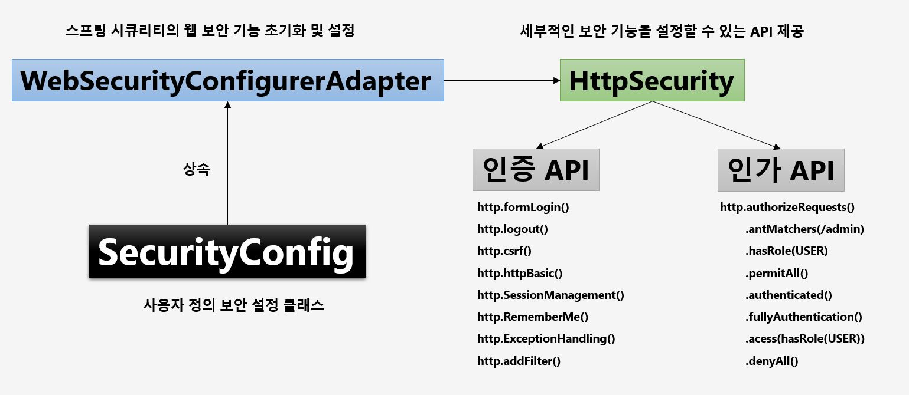
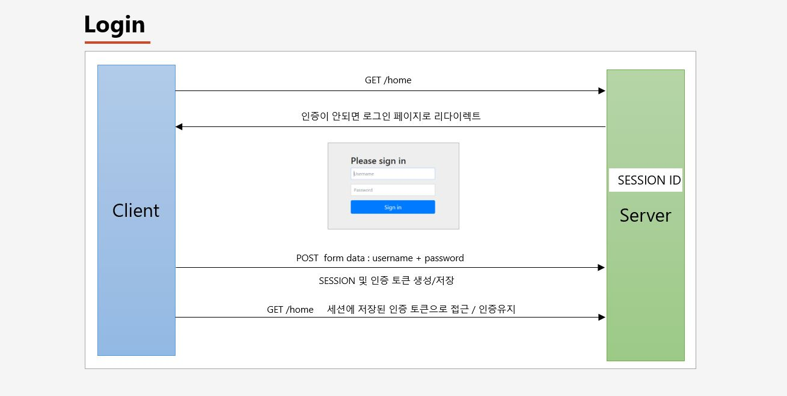
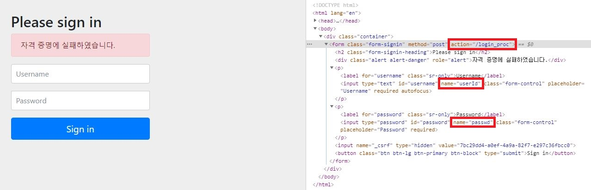
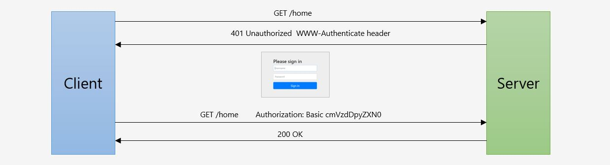

# 스프링 부트 기반 스프링 시큐리티 프로젝트

- Spring Boot
- JDK 11
- Postgresql
- Spring Data JPA
- Thymeleaf
- Spring MVC 
- Spring Security

## 강좌 소개

- 메소드 보안
  - AOP 기반
- URL 기반 보안
  - Filter 기반

## 프로젝트 생성

초기에는 spring initializr 를 이용하여 `spring web` 만 선택해서 스프링 부트 프로젝트를 생성한다.

> spring web 을 선택해서 프로젝트를 생성하면 spring-boot-starter-web 의존성이 자동으로 추가가 된다.

## IndexController 생성

이름은 뭐든 상관 없다. xxxApplication.java 와 동일한 위치에 WelcomeController(IndexController) 를 생성해준다.

그리고 톰캣이 제대로 구동이 됬는지 확인하기 위해 @RestController 어노테이션을 붙이고 `루트(/)` 로 접속할 수 있도록
핸들러 메서드를 생성해준다.

```java
@RestController
public class SecurityController {

    @GetMapping("/")
    public String index() {
        return "home";
    }

}
```

그리고 `localhost:8080/` 으로 접속하면 home 이라는 문자열이 찍히는 것을 확인할 수 있다.

## 시큐리티 의존성 추가

```xml
<dependency>
    <groupId>org.springframework.boot</groupId>
    <artifactId>spring-boot-starter-security</artifactId>
</dependency>
```

시큐리티 의존성을 추가하고 톰캣을 시작하면 콘솔에 아래와 같은 문자열이 찍힌다.

 `Using generated security password: b6047e41-e261-1234-123a-9e6abc11b059` 	

스프링 시큐리티가 기본으로 제공하는 패스워드이다. 아이디는 `user` 라는 문자열을 기본으로 제공한다. 그리고 다시 `localhost:8080/` 으로 접속하면 로그인 페이지가 나오게된다. 
그리고 id 와 pw 를 입력하여 접속하게 되면 home 이라는 문자열이 정상적으로 나오게 된다.

> 즉, 시큐리티 의존성을 추가함으로써 인증을 받아야만 자원(리소스)에 접근 가능하게 되었다.

- 스프링 시큐리티 의존성 추가 시 일어나는 일들
	- 서버가 기동되면 스프링 시큐리티의 초기화 작업 및 보안 설정이 이루어진다.
	- 별도의 설정이나 구현을 하지 않아도 기본적인 웹 보안 기능이 현재 시스템에 연동되어 작동한다.
		+ 모든 요청은 인증이 되어야 자원에 접근이 가능하다.
		+ 인증 방식은 폼 로그인 방식과 httpBasic 로그인 방식을 제공한다.
		+ 기본 로그인 페이지를 제공한다.
		+ 기본 계정 한 개를 제공한다. (id : user / pw : 콘솔에 찍히는 랜덤 문자열)
		
## 사용자 정의 보안 기능 구현



- WebSecurityConfigurerAdapter

스프링 시큐리티 의존성을 설정하고 WebSecurityConfigurerAdapter 클래스의 아래 메서드에 디버그를 찍으면, 
서버가 실행되면서 해당 메서드에 진입하는것을 알 수있다.

```java
    protected final HttpSecurity getHttp() throws Exception {
        if (this.http != null) {
            return this.http;
        } else {
            AuthenticationEventPublisher eventPublisher = this.getAuthenticationEventPublisher();
            this.localConfigureAuthenticationBldr.authenticationEventPublisher(eventPublisher);
            AuthenticationManager authenticationManager = this.authenticationManager();
            this.authenticationBuilder.parentAuthenticationManager(authenticationManager);
            Map<Class<?>, Object> sharedObjects = this.createSharedObjects();
	    // HttpSecurity 객체 생성
            this.http = new HttpSecurity(this.objectPostProcessor, this.authenticationBuilder, sharedObjects);
            if (!this.disableDefaults) {
	        // 여기서 11개의 세부적인 보안기능을 설정할 수 있는 API 를 제공하는 것을 알 수있다.
                // 이 기능은 HttpSecurity 가 제공한다.
                ((HttpSecurity)((DefaultLoginPageConfigurer)((HttpSecurity)((HttpSecurity)((HttpSecurity)((HttpSecurity)((HttpSecurity)((HttpSecurity)((HttpSecurity)((HttpSecurity)this.http.csrf().and()).addFilter(new WebAsyncManagerIntegrationFilter()).exceptionHandling().and()).headers().and()).sessionManagement().and()).securityContext().and()).requestCache().and()).anonymous().and()).servletApi().and()).apply(new DefaultLoginPageConfigurer())).and()).logout();
                ClassLoader classLoader = this.context.getClassLoader();
                List<AbstractHttpConfigurer> defaultHttpConfigurers = SpringFactoriesLoader.loadFactories(AbstractHttpConfigurer.class, classLoader);
                Iterator var6 = defaultHttpConfigurers.iterator();

                while(var6.hasNext()) {
                    AbstractHttpConfigurer configurer = (AbstractHttpConfigurer)var6.next();
                    this.http.apply(configurer);
                }
            }

            this.configure(this.http);
            return this.http;
        }
    }
```

위 코드에서 exceptionHandling 을 타고 들어가서 ExceptionHandlingConfigurer 클래스의 configure 메서드를 보면 ExceptionTranslationFilter 를 생성하여 사용하는것을 알 수 있다.

- ExceptionHandlingConfigurer 

```java
    public void configure(H http) {
        AuthenticationEntryPoint entryPoint = this.getAuthenticationEntryPoint(http);
        ExceptionTranslationFilter exceptionTranslationFilter = new ExceptionTranslationFilter(entryPoint, this.getRequestCache(http));
        AccessDeniedHandler deniedHandler = this.getAccessDeniedHandler(http);
        exceptionTranslationFilter.setAccessDeniedHandler(deniedHandler);
        exceptionTranslationFilter = (ExceptionTranslationFilter)this.postProcess(exceptionTranslationFilter);
        http.addFilter(exceptionTranslationFilter);
    }
```

> 위 디버깅을 토대로 알 수 있는 것은 시큐리티 사용자 보안설정 11 개의 API 들이, 각각의 설정 클래스를 호출하는 것을 
알 수 있고, 각각의 설정 클래스가 필터를 생성하고 있다는 것을 알 수 있다.

- WebSecurityConfigurerAdapter 의 configure 메서드

WebSecurityConfigurerAdapter 의 configure 메서드는 `스프링 시큐리티의 웹 보안 기능 초기화 및 설정` 작업을 제공한다.
이 메서드를 상속 받아서 `사용자 정의 보안 설정 클래스`를 만들어서 자신만의 보안 기능을 만들어 사용할 수 있다.

```java
    protected void configure(HttpSecurity http) throws Exception {
        this.logger.debug("Using default configure(HttpSecurity). If subclassed this will potentially override subclass configure(HttpSecurity).");
        ((HttpSecurity)((HttpSecurity)((AuthorizedUrl)http.authorizeRequests().anyRequest()).authenticated().and()).formLogin().and()).httpBasic();
    }
```

위 코드를 분석하자면 다음과 같다.

- http.authorizeRequests() : 보안 설정을 하겠다는 의미
- http.anyRequest.authenticated() : 어떠한 요청에도 인증을 요구한다는 의미
- http.formLogin().and().httpBasic() : formLogin 방식과 httpBasic 방식을 지원한다는 의미

> 즉, 루트(/) 로 접속하더라도 인증을 하지 않을 경우 formLogin 을 통해 다시 폼 로그인 페이지로 이동하게 만든다.

### 스프링 환경 설정 파일(application.properties)을 이용하여, 시큐리티 로그인 ID / PW 설정 방법

- application.properties

```xml
spring.security.user.name=user
spring.security.user.password=root
```

위 처럼 설정하면 톰캣에서 제공하는 랜덤 문자열의 패스워드 대신에, 자신이 설정한 패스워드로 로그인 할 수 있다.

## 인증 API - Form 인증



```java
http.formLogin() // Form 로그인 인증 기능이 작동함
	.loginPage("/login.html") // 사용자 정의 로그인 페이지
	.defaultSuccessUrl("/home") // 로그인 성공 후 이동 페이지
	.failureUrl("/login.html?error=true") // 로그인 실패 후 이동 페이지
	.usernameParameter("username") // 아이디 파라미터명 설정
	.passwordParameter("password") // 패스워드 파라미터명 설정
	.loginProcessingUrl("/login") // 로그인 Form Action Url
	.successHandler(loginSuccessHandler()) // 로그인 성공 후 핸들러
	.failureHandler(loginFailureHandler()) // 로그인 실패 후 핸들러
```

- Example

```java
    @Override
    protected void configure(HttpSecurity http) throws Exception {
        http.authorizeRequests()
                .anyRequest().authenticated();
        http.formLogin()
                .loginPage("/loginPage")
                .defaultSuccessUrl("/")
                .failureUrl("/login")
                .usernameParameter("userId")
                .passwordParameter("passwd")
                .loginProcessingUrl("/login_proc")
                .successHandler(new AuthenticationSuccessHandler() {
                    @Override
                    public void onAuthenticationSuccess(HttpServletRequest httpServletRequest, HttpServletResponse httpServletResponse, Authentication authentication) throws IOException, ServletException {
                        System.out.println("authentication : " + authentication.getName()); // application.properties 에서 설정한 userName 이 찍힌다.
                        httpServletResponse.sendRedirect("/");
                    }
                })
                .failureHandler(new AuthenticationFailureHandler() {
                    @Override
                    public void onAuthenticationFailure(HttpServletRequest httpServletRequest, HttpServletResponse httpServletResponse, AuthenticationException e) throws IOException, ServletException {
                        System.out.println("exception : " + e.getMessage()); // Bad credentials
                        httpServletResponse.sendRedirect("/login");
                    }
                })
                .permitAll(); // permitAll() 을 하는 이유는 loginPage("/loginPage") 설정한 loginPage 는 인증 없이도 접근이 가능 해야 하기 때문이다.
    }
```    

successHandler 와 failureHandler 는 각각 `AuthenticationSuccessHandler` 인터페이스와 `AuthenticationFailureHandler` 인터페이스를 구현한 구현체를 생성해야 하는데, 위 예제는 익명 클래스로 생성하였다. 폼 로그인 페이지에서 로그인에 실패하면 failureHandler 를 타고 `Bad credentials` 라는 에러 메시지가 찍힌다. 로그인에 성공하면 application.properties 에서 설정한 userName 이 찍힌다.

```java
.usernameParameter("userId")
.passwordParameter("passwd")
.loginProcessingUrl("/login_proc")
```

위 처럼 설정하게 되면 시큐리티가 기본으로 제공하는 폼 로그인 페이지에서 개발자 도구(F12)를 열어서 확인해보면 다음과 같이 설정이 되어있다.



## 인증 API - HTTP Basic 인증 (BasicAuthenticationFilter)


