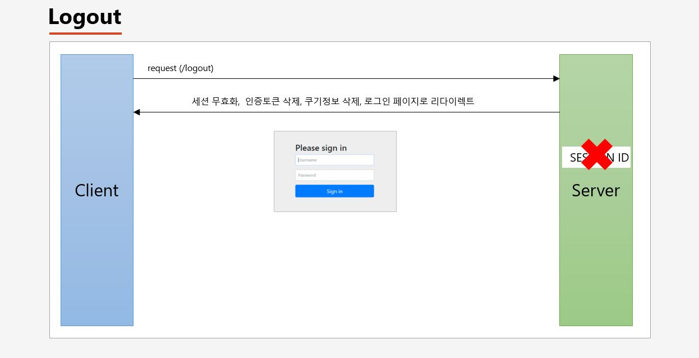
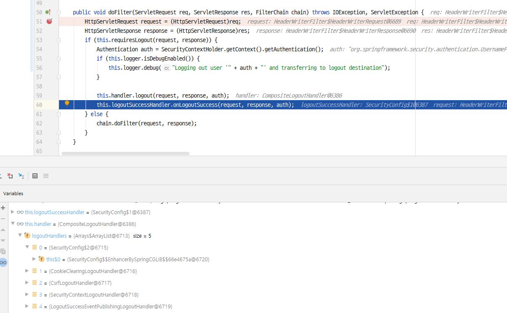

# 스프링 부트 기반 스프링 시큐리티 프로젝트

- Spring Boot
- JDK 11
- Postgresql
- Spring Data JPA
- Thymeleaf
- Spring MVC 
- Spring Security

## 강좌 소개

- 메소드 보안
  - AOP 기반
- URL 기반 보안
  - Filter 기반

## 프로젝트 생성

초기에는 spring initializr 를 이용하여 `spring web` 만 선택해서 스프링 부트 프로젝트를 생성한다.

> spring web 을 선택해서 프로젝트를 생성하면 spring-boot-starter-web 의존성이 자동으로 추가가 된다.

## IndexController 생성

이름은 뭐든 상관 없다. xxxApplication.java 와 동일한 위치에 WelcomeController(IndexController) 를 생성해준다.

그리고 톰캣이 제대로 구동이 됬는지 확인하기 위해 @RestController 어노테이션을 붙이고 `루트(/)` 로 접속할 수 있도록
핸들러 메서드를 생성해준다.

```java
@RestController
public class SecurityController {

    @GetMapping("/")
    public String index() {
        return "home";
    }

}
```

그리고 `localhost:8080/` 으로 접속하면 home 이라는 문자열이 찍히는 것을 확인할 수 있다.

## 시큐리티 의존성 추가

```xml
<dependency>
    <groupId>org.springframework.boot</groupId>
    <artifactId>spring-boot-starter-security</artifactId>
</dependency>
```

시큐리티 의존성을 추가하고 톰캣을 시작하면 콘솔에 아래와 같은 문자열이 찍힌다.

 `Using generated security password: b6047e41-e261-1234-123a-9e6abc11b059` 	

스프링 시큐리티가 기본으로 제공하는 패스워드이다. 아이디는 `user` 라는 문자열을 기본으로 제공한다. 그리고 다시 `localhost:8080/` 으로 접속하면 로그인 페이지가 나오게된다. 
그리고 id 와 pw 를 입력하여 접속하게 되면 home 이라는 문자열이 정상적으로 나오게 된다.

> 즉, 시큐리티 의존성을 추가함으로써 인증을 받아야만 자원(리소스)에 접근 가능하게 되었다.

- 스프링 시큐리티 의존성 추가 시 일어나는 일들
	- 서버가 기동되면 스프링 시큐리티의 초기화 작업 및 보안 설정이 이루어진다.
	- 별도의 설정이나 구현을 하지 않아도 기본적인 웹 보안 기능이 현재 시스템에 연동되어 작동한다.
		+ 모든 요청은 인증이 되어야 자원에 접근이 가능하다.
		+ 인증 방식은 폼 로그인 방식과 httpBasic 로그인 방식을 제공한다.
		+ 기본 로그인 페이지를 제공한다.
		+ 기본 계정 한 개를 제공한다. (id : user / pw : 콘솔에 찍히는 랜덤 문자열)
		
## 사용자 정의 보안 기능 구현


- WebSecurityConfigurerAdapter

스프링 시큐리티 의존성을 설정하고 WebSecurityConfigurerAdapter 클래스의 아래 메서드에 디버그를 찍으면, 
서버가 실행되면서 해당 메서드에 진입하는것을 알 수있다.

```java
    protected final HttpSecurity getHttp() throws Exception {
        if (this.http != null) {
            return this.http;
        } else {
            AuthenticationEventPublisher eventPublisher = this.getAuthenticationEventPublisher();
            this.localConfigureAuthenticationBldr.authenticationEventPublisher(eventPublisher);
            AuthenticationManager authenticationManager = this.authenticationManager();
            this.authenticationBuilder.parentAuthenticationManager(authenticationManager);
            Map<Class<?>, Object> sharedObjects = this.createSharedObjects();
	    // HttpSecurity 객체 생성
            this.http = new HttpSecurity(this.objectPostProcessor, this.authenticationBuilder, sharedObjects);
            if (!this.disableDefaults) {
	        // 여기서 11개의 세부적인 보안기능을 설정할 수 있는 API 를 제공하는 것을 알 수있다.
                // 이 기능은 HttpSecurity 가 제공한다.
                ((HttpSecurity)((DefaultLoginPageConfigurer)((HttpSecurity)((HttpSecurity)((HttpSecurity)((HttpSecurity)((HttpSecurity)((HttpSecurity)((HttpSecurity)((HttpSecurity)this.http.csrf().and()).addFilter(new WebAsyncManagerIntegrationFilter()).exceptionHandling().and()).headers().and()).sessionManagement().and()).securityContext().and()).requestCache().and()).anonymous().and()).servletApi().and()).apply(new DefaultLoginPageConfigurer())).and()).logout();
                ClassLoader classLoader = this.context.getClassLoader();
                List<AbstractHttpConfigurer> defaultHttpConfigurers = SpringFactoriesLoader.loadFactories(AbstractHttpConfigurer.class, classLoader);
                Iterator var6 = defaultHttpConfigurers.iterator();

                while(var6.hasNext()) {
                    AbstractHttpConfigurer configurer = (AbstractHttpConfigurer)var6.next();
                    this.http.apply(configurer);
                }
            }

            this.configure(this.http);
            return this.http;
        }
    }
```

위 코드에서 exceptionHandling 을 타고 들어가서 ExceptionHandlingConfigurer 클래스의 configure 메서드를 보면 ExceptionTranslationFilter 를 생성하여 사용하는것을 알 수 있다.

- ExceptionHandlingConfigurer 

```java
    public void configure(H http) {
        AuthenticationEntryPoint entryPoint = this.getAuthenticationEntryPoint(http);
        ExceptionTranslationFilter exceptionTranslationFilter = new ExceptionTranslationFilter(entryPoint, this.getRequestCache(http));
        AccessDeniedHandler deniedHandler = this.getAccessDeniedHandler(http);
        exceptionTranslationFilter.setAccessDeniedHandler(deniedHandler);
        exceptionTranslationFilter = (ExceptionTranslationFilter)this.postProcess(exceptionTranslationFilter);
        http.addFilter(exceptionTranslationFilter);
    }
```

> 위 디버깅을 토대로 알 수 있는 것은 시큐리티 사용자 보안설정 11 개의 API 들이, 각각의 설정 클래스를 호출하는 것을 
알 수 있고, 각각의 설정 클래스가 필터를 생성하고 있다는 것을 알 수 있다.

- WebSecurityConfigurerAdapter 의 configure 메서드

WebSecurityConfigurerAdapter 의 configure 메서드는 `스프링 시큐리티의 웹 보안 기능 초기화 및 설정` 작업을 제공한다.
이 메서드를 상속 받아서 `사용자 정의 보안 설정 클래스`를 만들어서 자신만의 보안 기능을 만들어 사용할 수 있다.

```java
    protected void configure(HttpSecurity http) throws Exception {
        this.logger.debug("Using default configure(HttpSecurity). If subclassed this will potentially override subclass configure(HttpSecurity).");
        ((HttpSecurity)((HttpSecurity)((AuthorizedUrl)http.authorizeRequests().anyRequest()).authenticated().and()).formLogin().and()).httpBasic();
    }
```

위 코드를 분석하자면 다음과 같다.

- http.authorizeRequests() : 보안 설정을 하겠다는 의미, 시큐리티 처리에 HttpServletRequest를 이용한다는 것을 의미
- http.anyRequest.authenticated() : 어떠한 요청에도 인증을 요구한다는 의미
- http.formLogin().and().httpBasic() : formLogin 방식과 httpBasic 방식을 지원한다는 의미

> 즉, 루트(/) 로 접속하더라도 인증을 하지 않을 경우 formLogin 을 통해 다시 폼 로그인 페이지로 이동하게 만든다.

### 스프링 환경 설정 파일(application.properties)을 이용하여, 시큐리티 로그인 ID / PW 설정 방법

- application.properties

```xml
spring.security.user.name=user
spring.security.user.password=root
```

위 처럼 설정하면 톰캣에서 제공하는 랜덤 문자열의 패스워드 대신에, 자신이 설정한 패스워드로 로그인 할 수 있다.

## 인증 API - Form 인증


```java
http.formLogin() // Form 로그인 인증 기능이 작동함
	.loginPage("/login.html") // 사용자 정의 로그인 페이지
	.defaultSuccessUrl("/home") // 로그인 성공 후 이동 페이지
	.failureUrl("/login.html?error=true") // 로그인 실패 후 이동 페이지
	.usernameParameter("username") // 아이디 파라미터명 설정
	.passwordParameter("password") // 패스워드 파라미터명 설정
	.loginProcessingUrl("/login") // 로그인 Form Action Url
	.successHandler(loginSuccessHandler()) // 로그인 성공 후 핸들러
	.failureHandler(loginFailureHandler()) // 로그인 실패 후 핸들러
```

- Example

```java
    @Override
    protected void configure(HttpSecurity http) throws Exception {
        http.authorizeRequests()
                .anyRequest().authenticated();
        http.formLogin()
                .loginPage("/loginPage")
                .defaultSuccessUrl("/")
                .failureUrl("/login")
                .usernameParameter("userId")
                .passwordParameter("passwd")
                .loginProcessingUrl("/login_proc")
                .successHandler(new AuthenticationSuccessHandler() {
                    @Override
                    public void onAuthenticationSuccess(HttpServletRequest httpServletRequest, HttpServletResponse httpServletResponse, Authentication authentication) throws IOException, ServletException {
                        System.out.println("authentication : " + authentication.getName()); // application.properties 에서 설정한 userName 이 찍힌다.
                        httpServletResponse.sendRedirect("/");
                    }
                })
                .failureHandler(new AuthenticationFailureHandler() {
                    @Override
                    public void onAuthenticationFailure(HttpServletRequest httpServletRequest, HttpServletResponse httpServletResponse, AuthenticationException e) throws IOException, ServletException {
                        System.out.println("exception : " + e.getMessage()); // Bad credentials
                        httpServletResponse.sendRedirect("/login");
                    }
                })
                .permitAll(); // permitAll() 을 하는 이유는 loginPage("/loginPage") 설정한 loginPage 는 인증 없이도 접근이 가능 해야 하기 때문이다.
    }
```    

successHandler 와 failureHandler 는 각각 `AuthenticationSuccessHandler` 인터페이스와 `AuthenticationFailureHandler` 인터페이스를 구현한 구현체를 생성해야 하는데, 위 예제는 익명 클래스로 생성하였다. 폼 로그인 페이지에서 로그인에 실패하면 failureHandler 를 타고 `Bad credentials` 라는 에러 메시지가 찍힌다. 로그인에 성공하면 application.properties 에서 설정한 userName 이 찍힌다.

```java
.usernameParameter("userId")
.passwordParameter("passwd")
.loginProcessingUrl("/login_proc")
```

위 처럼 설정하게 되면 시큐리티가 기본으로 제공하는 폼 로그인 페이지에서 개발자 도구를 열어서 확인해보면 다음과 같이 설정이 되어있다.


즉, `사용자 정의 로그인 페이지`를 만들어 사용하는 경우 로그인 페이지의 name 을 스프링 시큐리티에서 설정한 이름과 동일하게 맞춰줘야 한다.

## Form Login 인증 필터 : UsernamePasswordAuthenticationFilter

Form Login 방식에서 실제로 사용자가 로그인을 하게되면 인증 처리가 이루어지는데 그 인증을 처리하는 필터가 바로 __UsernamePasswordAuthenticationFilter__ 이다.


AntPathRequestMatcher 는 요청 URL 정보가 매칭되는지 확인한다. 디폴트는 login 이다. 이 값은 변경이 가능하다. 변경 방법은 위에서 배운 `loginProcessingUrl` 을 통해서 원하는 로그인 요청 URL로 변경이 가능하다. 이 정보가 일치하게되면 실제 인증처리를 진행하게 된다. 

인증 처리 방식은 먼저 Authentication 객체를 만들어서 입력한 Username 과 Password 를 저장한다. AuthenticationManager 는 AuthenticationProvider 클래스 타입의 객체들을 가지고 있어서 이 중에서 하나를 선택해서 인증 처리를 위임한다. 즉, 실제 인증 처리는 AuthenticationProvider 가 처리한다. 인증 처리에 실패하면 AuthenticationException 을 통해 다시 UsernamePasswordAutenticationFilter 로 이동한다. 인증에 성공하면 user 정보와 Authorities(권한) 정보를 저장하여 다시 AuthenticationManager 에게 리턴한다. AuthenticationManager 는 AuthenticationProvider 에게 받은 최종적인 인증 객체인 `Authentication` 을 필터에게 전달한다. 그리고 이 필터는 Authentication 을 `SecurityContext` 에 저장한다. 
그리고 마지막으로 SuccessHandler 를 통해 성공 후 작업을 처리하게 된다.

> 즉, SecurityContext 는 인증객체(Authentication)를 저장하는 객체이다.


### AbstractAuthenticationProcessingFilter 를 통해 시큐리티의 필터 목록들 확인하기

AbstractAuthenticationProcessingFilter 는 UsernamePasswordAuthenticationFilter 의 상위 클래스이다. AbstractAuthenticationProcessingFilter 에서 doFilter 메서드에 breakpoint 를 찍어
디버깅 하면 시큐리티의 필터 목록들을 볼 수 있다. 시큐리티 필터는 총 14개가 존재하며 리스트에 담긴 순서대로 동작한다. 이 14개의 필터는 `FilterChainProxy` 라는 빈 클래스가 관리하며
우리가 SecurityConfig 에서 API 를 사용할 때 API 에 알맞은 Filter 들도 같이 생성된다. 예를들어 http.formLogin() 을 사용한다면 UsernamePasswordAuthenticationFilter 가 생성된다.


해당 위치에 breakPoint 를 찍고 `localhost:8080/` 루트 페이지로 접속하게되면 필터들을 확인할 수 있다. 폼 로그인 페이지에서 id 와 pw 를 입력하면 

```java
authResult = this.attemptAuthentication(request, response);
```

위 코드의 attemptAuthentication 를 쭉 타고 들어가 보면 그림에 나와있는 로직을 이해할 수 있다.

## Logout 처리 : LogoutFilter



클라이언트가 logout 요청을 보내면 시큐리티가 처리를 한다. 시큐리티가 로그아웃 처리를 할 때 하는 일은 세션 무효화, 인증토큰 삭제, 쿠키 정보삭제, 로그인 페이지로 리다이렉트 등이 있다.

- Logout API 설정

```java
protected void configure(HttpSecurity http) throws Exception {
	http.logout() // 로그아웃 처리(로그아웃 기능이 작동함)
		.logoutUrl("/logout") // 로그아웃 처리 URL
		.logoutSuccessUrl("/login") // 로그아웃 성공 후 이동페이지
		.deleteCookies("JSESSIONID", "remember-me") // 로그아웃 후 쿠키 삭제
		.addLogoutHandler(logoutHandler()) // 로그아웃 핸들러
		.logoutSuccessHandler(logoutSuccessHandler()) // 로그아웃 성공 후 핸들러
}
```


- LogoutFilter 디버깅 하기

```java
        http.logout()
                .logoutUrl("/logout")
                .logoutSuccessUrl("/login")
                .addLogoutHandler(new LogoutHandler() {
                    @Override
                    public void logout(HttpServletRequest httpServletRequest, HttpServletResponse httpServletResponse, Authentication authentication) {
                        HttpSession session = httpServletRequest.getSession();
                        session.invalidate();
                    }
                })
                .logoutSuccessHandler(new LogoutSuccessHandler() {
                    @Override
                    public void onLogoutSuccess(HttpServletRequest httpServletRequest, HttpServletResponse httpServletResponse, Authentication authentication) throws IOException, ServletException {
                        httpServletResponse.sendRedirect("/login");
                    }
                })
                .deleteCookies("remember-me");
```



로그인을 하고나서 `localhost:8080/logout` 페이지에서 로그아웃 버튼을 누르면 LogoutFilter 의 doFilter 가 동작하게 된다. this.handler 에 담긴 핸들러를 보면 총 5개의 핸들러가 있는데
0번 은 우리가 직접 SecurityConfig 에서 설정한 핸들러이며, 1번 부터 4번은 스프링 시큐리티에서 기본으로 제공하는 핸들러이다.


## Remember Me 인증


- 세션 프로세스

1. 클라이언트가 서버에 접속시 세션 ID 를 발급
2. 서버에서는 클라이언트로 발급해준 세션 ID 를 쿠키를 사용해 저장 (JSESSIONID)
3. 클라이언트는 다시 접속할 때, 이 쿠키(JSESSIONID)를 이용해서 세션 ID 값을 서버에 전달

- Remember Me Example

```java
.and()
	.rememberMe()
	.rememberMeParameter("remember")
	.tokenValiditySeconds(3600)
	.userDetailsService(userDetailsService);
```

localhost:8080/login 에서 로그인을 한다. 그리고 크롬 확장 프로그램인 `EditThisCookie` 를 설치한다. 그리고 로그인된 페이지서 확장 프로그램을 열어보면 아래와 같이 나온다. EditThisCookie 은
쿠키 정보를 보여준다. 쿠키는 Key 와 Value 값으로 파일로 저장하는데 EditThisCookie 를 이용해서 쿠키를 삭제할 수도 있다.


JSESSIONID 의 쿠키 값을 삭제하면 서버는 로그인을 한 사용자임에도 불구하고 세션 ID 에 담긴 값이 없으므로 처음 로그인한 사용자라고 판단하고 다시 인증을 요구한다.

이번에는 rembmer-me 기능을 체크하고 로그인을 한 후에 쿠키 정보를 확인해보면 remember-me 라는 쿠키 정보도 생겼음을 알 수 있다.


remember-me 키에 대한 value 값에는 로그인 id / pw 와 쿠키 만료일이 담겨있다. 

이제 다시 JSESSIONID 의 쿠키 값을 삭제하고 루트 페이지에 접속해보면 로그인이 된 상태를 확인할 수 있다.

이런 기능이 가능하도록 해주는 것이 `RememberMeAuthenticationFilter` 가 해주며, JSESSIONID 가 없더라 reqeust header 에 remember-me 가 존재하면, 해당 value 에 있는 id 와 pw 를
파싱하여 User 정보를 얻고, User 객체를 통해서 다시금 인증을 시도하고, 인증을 성공하게 된다. 그리고 다시 JSESSIONID 가 생기게 된다.

### RememberMeAuthenticationFilter


remember-me 를 체크하고 로그인하면 AbstractAuthenticationProcessingFilter 에서 rememberMe에 대한 처리를 한다. rememberMe 쿠키를 reponse 에 담는다.

```java
    protected void successfulAuthentication(HttpServletRequest request, HttpServletResponse response, FilterChain chain, Authentication authResult) throws IOException, ServletException {
        if (this.logger.isDebugEnabled()) {
            this.logger.debug("Authentication success. Updating SecurityContextHolder to contain: " + authResult);
        }

        SecurityContextHolder.getContext().setAuthentication(authResult);
	
	// remember-me 처리
        this.rememberMeServices.loginSuccess(request, response, authResult);
        if (this.eventPublisher != null) {
            this.eventPublisher.publishEvent(new InteractiveAuthenticationSuccessEvent(authResult, this.getClass()));
        }

        this.successHandler.onAuthenticationSuccess(request, response, authResult);
    }
```

## AnonymousAuthenticationFilter


## 동시 세션 제어, 세션 고정 보호, 세션 정책

### 동시 세션 제어


동시 세션 제어의 전략은 2가지가 있다. 

- 이전 사용자 세션 만료 (`maxSessionsPreventsLogin(false)` 디폴트는 false 이다.)
- 현재 사용자 인증 실패 (`maxSessionsPreventsLogin(true)`)


현재 사용자 인증 실패 전략 테스트를 하기 위해서 서로 다른 브라우저 2개를 열고, 로그인을 시도하게되면 나중에 로그인 시도하는 브라우저에서 아래와 같은 화면이 나온다.


이전 사용자 세션 만료 전략을 테스트 하기 위해서는 `maxSessionsPreventsLogin(false)` 설정을 하고 테스트하면 된다.

### 세션 고정 보호

- 세션 고정 공격


none 으로 설정하게 되면 세션 고정 공격을 당할 수 있다. 기본 값은 `changeSessionId()` 이다. 따라서 우리가 위 처럼 설정하지 않더라도 스프링 시큐리티가 자동으로 초기화 시켜준다.

- 세션 고정 공격 테스트

```java
@Override
protected void configure(HttpSecurity http) throws Exception {
	http.authorizeRequests()
		.anyRequest().authenticated();
	http.formLogin();
	http.sessionManagement()
		.sessionFixation().none();
}
```    

브라우저 2개를 연다. (크롬 : 사용자 , 엣지 : 공격자) 그리고 공격자가 localhost:8080/login 페이지에 접속한다. 그리고 네트워크 -> F5 -> login 리소스 클릭 해서 쿠키를 확인해보면 JSESSIONID 가 발급이 되어있다. 해당 쿠킥 값을 복사해서 크롬(사용자)에 가서 EditThisCookie 를 열어서 쿠키 값을 변경한다. 그리고 사용자에서 로그인을 하게되면, 공격자에서는 로그인이 없어도 루트 페이지에 접근이 가능하게 된다.


### 세션 정책


## SessionManagementFilter, ConcurrentSessionFilter

- SessionManagementFilter
	- 세션관리 : 인증 시 사용자의 세션정보를 등록, 조회, 삭제 등의 세션 이력을 관리
	- 동시적 세션 제어 : 동일 계정으로 접속이 허용되는 최대 세션수를 제한
	- 세션 고정 보호 : 인증 할 때마다 세션 쿠키를 새로 발급하여 공격자의 쿠키 조작을 방지
	- 세션 생성 정책 : Always, If_Required, Never, Stateless
	
- ConcurrentSessionFilter
	- 매 요청 마다 현재 사용자의 세션 만료 여부 체크
	- 세션이 만료로 설정되었을 경우 즉시 만료 처리
	- session.isExpired() == true
		- 로그아웃 처리
		- 즉시 오류 페이지 응답 : This session has been expired
		


### 동시적 세션 제어 테스트

- SecurityConfig

```java
@Override
protected void configure(HttpSecurity http) throws Exception {
	http.authorizeRequests()
		.anyRequest().authenticated();
	http.
		formLogin()
	.and 
		.sessionManagement()
		.maximumSessions(1)
		.maxSessionsPreventsLogin(true); // 현재 사용자 인증 실패 전략
}
```

- 크롬과 엣지 두 개의 브라우저를 준비한다.
- 크롬에서 먼저 로그인을 한다.
- ConcurrentSessionControlAuthenticationStrategy 클래스의 onAuthentication 메서드에 디버깅을한다.
- 쭉 따라가면서 어떻게 동작하는지 파악한다.
- 엣지에서 로그인을 한다.
- 디버깅을 하면서 어떻게 동작하는지 파악한다.


엣지로 로그인한 사용자는 화면이 위 처럼 나온다.

> maxSessionsPreventsLogin 에 설정하는 boolean 값은 ConcurrentSessionControlAuthentication 에 있는 exceptionIfMaximumExceeded 이다.

## 인가 API - 권한 설정 및 표현식

- 선언적 방식
	- URL
		- http.antMatchers("/user/**").hasRole("USER")
	- Method
		-
		```java
		@PreAuthorize("hasRole("USER"))
		public void user() {}
		```

- 동적 방식 : DB 연동 프로그래밍
	- URL
	- Method
	
- 권한 설정

```java
@Override
protected void configure(HttpSecurity http) throws Exception {
    http
        .antMatcher(“/shop/**”)
        .authorizeRequests()
            .antMatchers(“/shop/login”, “/shop/users/**”).permitAll()
	  .antMatchers(“/shop/mypage”).hasRole(“USER”)
            .antMatchers("/shop/admin/pay").access("hasRole('ADMIN')");
	  .antMatchers("/shop/admin/**").access("hasRole('ADMIN') or hasRole(‘SYS ')");
            .anyRequest().authenticated()
       }
```

> ※ 주의 사항 - 설정 시 구체적인 경로가 먼저 오고 그것 보다 큰 범위의 경로가 뒤에 오도록 해야 한다

- 인가 API 표현식


## 인증 API - HTTP Basic 인증 (BasicAuthenticationFilter)


