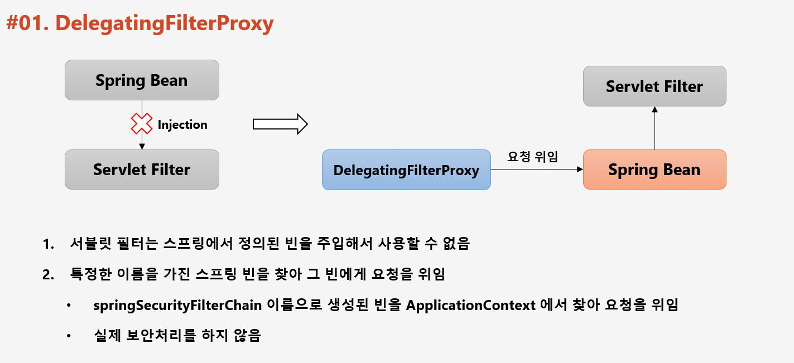
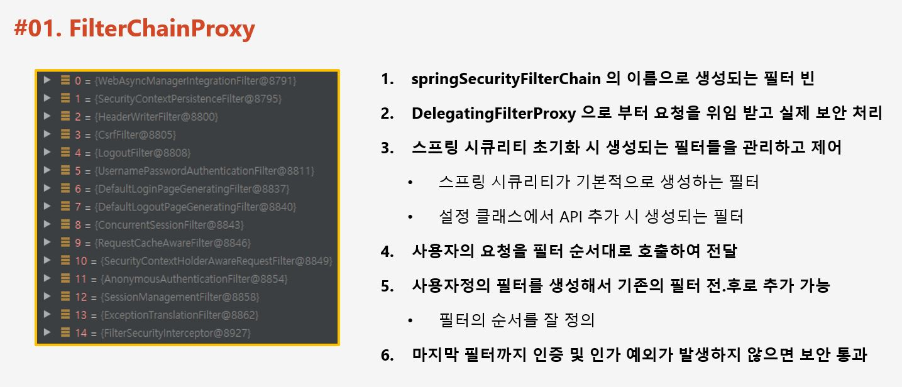
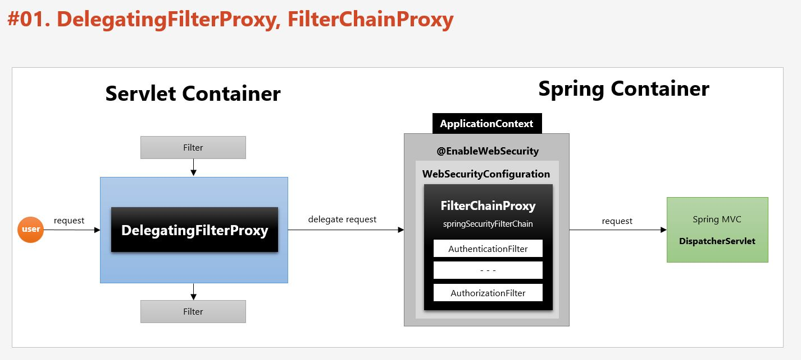

# DelegatingProxyChain 과 FilterChainProxy



Servlet Filter 는 Servlet 2.3 버전 부터 등장했다.

Servlet Filter 가 DelegatingProxyChain 으로 요청을 보내면 DelegatingProxyChain 을 통해 스프링 시큐리티가 Filter 기반으로 보안 처리를 할 수 있게 된다. 즉, DelegatingProxyChain 은 Servlet Filter 이기 때문에 가장 먼저 요청을 받게 되고, 그 요청을 스프링에게 전달하는 것이다.

특정한 이름을 가진 빈을 찾아 그 빈에게 요청을 위임하는데 그게 바로 `DelegatingProxyChain` 이다.



- AbstractAuthenticationProcessingFilter 

아래 메서드 디버깅을 통해 몇가지의 Filter 가 있는지 확인할 수 있다.

```java
    public void doFilter(ServletRequest req, ServletResponse res, FilterChain chain) throws IOException, ServletException {
        HttpServletRequest request = (HttpServletRequest)req;
        HttpServletResponse response = (HttpServletResponse)res;
        if (!this.requiresAuthentication(request, response)) {
            chain.doFilter(request, response);
        } else {
            if (this.logger.isDebugEnabled()) {
                this.logger.debug("Request is to process authentication");
            }

            Authentication authResult;
            try {
                authResult = this.attemptAuthentication(request, response);
                if (authResult == null) {
                    return;
                }

                this.sessionStrategy.onAuthentication(authResult, request, response);
            } catch (InternalAuthenticationServiceException var8) {
                this.logger.error("An internal error occurred while trying to authenticate the user.", var8);
                this.unsuccessfulAuthentication(request, response, var8);
                return;
            } catch (AuthenticationException var9) {
                this.unsuccessfulAuthentication(request, response, var9);
                return;
            }

            if (this.continueChainBeforeSuccessfulAuthentication) {
                chain.doFilter(request, response);
            }

            this.successfulAuthentication(request, response, chain, authResult);
        }
    }
```  

위 총 15개의 필터에 대해서 처리가 완료되고나면 Servlet 에 접근할 수 있다.



