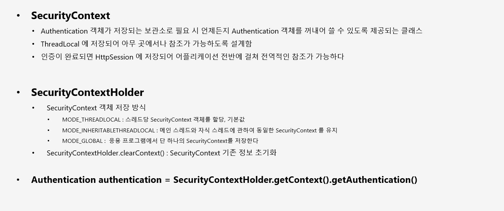
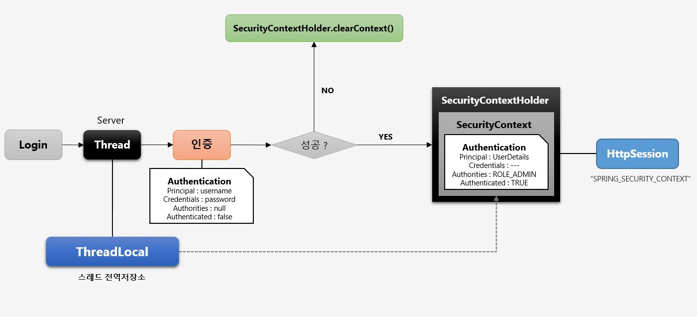

# SecurityContextHolder 와 SecurityContext

SecurityContextHolder 의 기본 전략은 ThreadLocal 이다.





## ThreadLocalSecurityContextHolderStrategy

```java
final class ThreadLocalSecurityContextHolderStrategy implements SecurityContextHolderStrategy {
    private static final ThreadLocal<SecurityContext> contextHolder = new ThreadLocal();

    ThreadLocalSecurityContextHolderStrategy() {
    }

    public void clearContext() {
        contextHolder.remove();
    }

    public SecurityContext getContext() {
        SecurityContext ctx = (SecurityContext)contextHolder.get();
        if (ctx == null) {
            ctx = this.createEmptyContext();
            contextHolder.set(ctx);
        }

        return ctx;
    }

    public void setContext(SecurityContext context) {
        Assert.notNull(context, "Only non-null SecurityContext instances are permitted");
        contextHolder.set(context);
    }

    public SecurityContext createEmptyContext() {
        return new SecurityContextImpl();
    }
}
```
