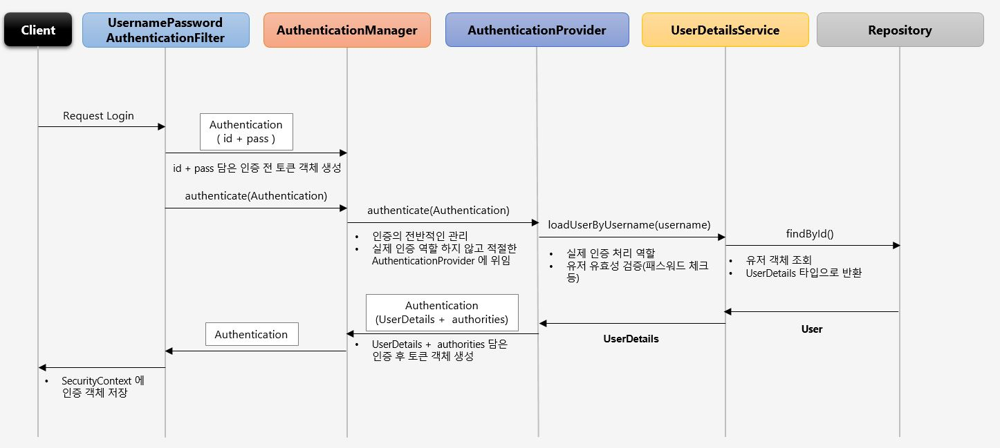
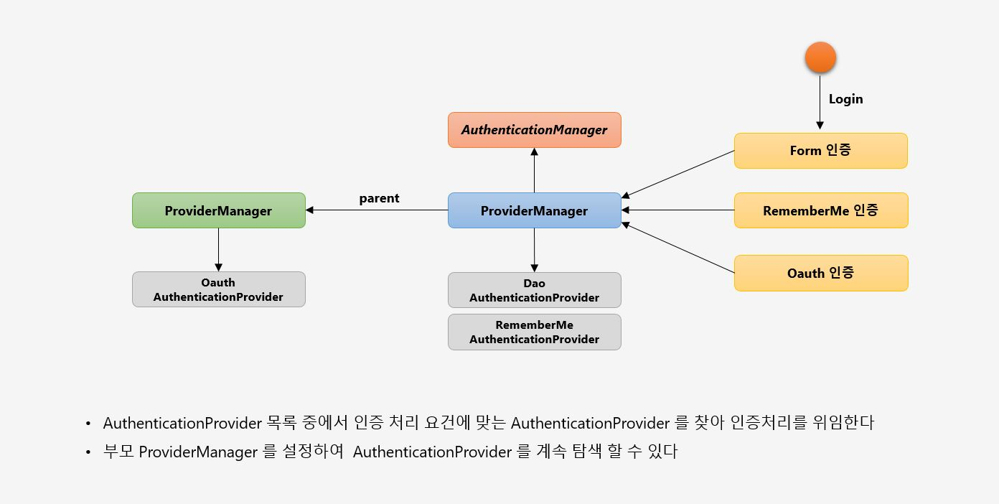
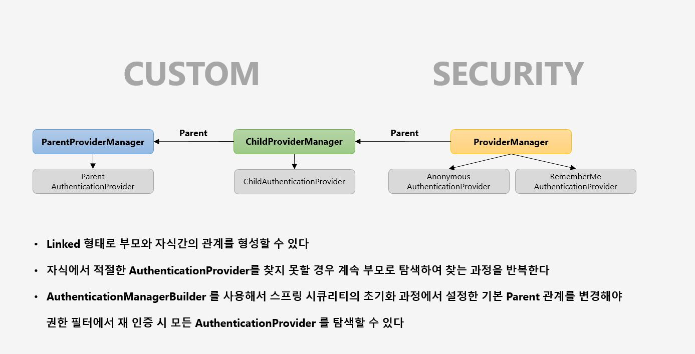
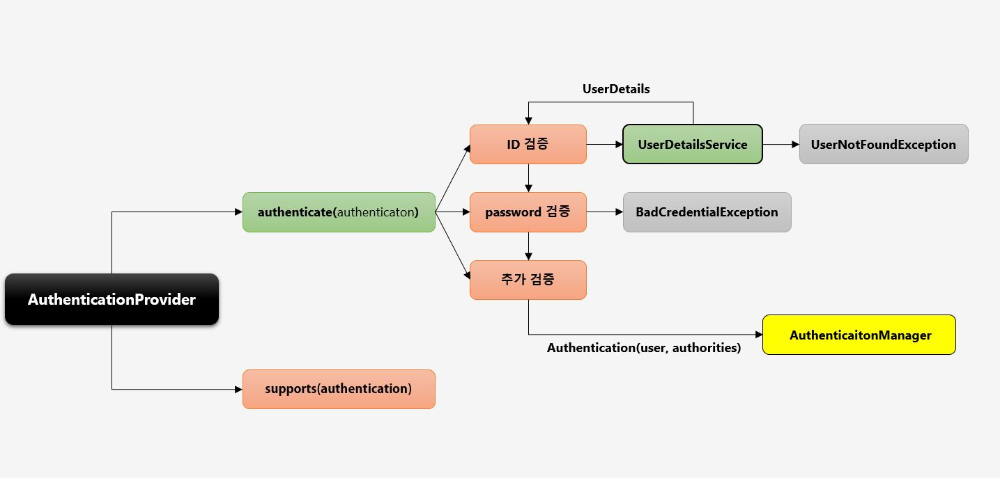

# UsernamePasswordAuthenticationFilter 

실제 로그인을 하게 되면 UsernamePasswordAuthenticationFilter 를 통해 처리된다.

## 로그인 인증 처리 과정(Authentication Flow)



로그인 처리가 되는 과정은 다음과 같다.

- `UsernamePasswordAuthenticationFilter 의 attemptAuthentication 메서드 호출`
  - 해당 메서드에서 POST 요청인지 확인(로그인은 POST 요청만 가능)
  - username 과 password 를 이용해서 UsernamePasswordAuthenticationToken 을 생성
  - 그리고 ProviderManager 의 authenticate 메서드로 리턴한다.

```java
    public Authentication attemptAuthentication(HttpServletRequest request, HttpServletResponse response) throws AuthenticationException {
        if (this.postOnly && !request.getMethod().equals("POST")) {
            throw new AuthenticationServiceException("Authentication method not supported: " + request.getMethod());
        } else {
            String username = this.obtainUsername(request);
            String password = this.obtainPassword(request);
            if (username == null) {
                username = "";
            }

            if (password == null) {
                password = "";
            }

            username = username.trim();
            UsernamePasswordAuthenticationToken authRequest = new UsernamePasswordAuthenticationToken(username, password);
            this.setDetails(request, authRequest);
            return this.getAuthenticationManager().authenticate(authRequest);
        }
    }
```  

  
- `ProviderManager 의 authenticate 메서드 호출`
  - result.provider.authenticate(authentication) 에서 AbstractUserDetailsAuthenticationProvider 의 authenticate 메서드를 호출한다.

```java
public Authentication authenticate(Authentication authentication) throws AuthenticationException {
        Class<? extends Authentication> toTest = authentication.getClass();
        AuthenticationException lastException = null;
        AuthenticationException parentException = null;
        Authentication result = null;
        Authentication parentResult = null;
        boolean debug = logger.isDebugEnabled();
        Iterator var8 = this.getProviders().iterator();

        while(var8.hasNext()) {
            AuthenticationProvider provider = (AuthenticationProvider)var8.next();
            if (provider.supports(toTest)) {
                if (debug) {
                    logger.debug("Authentication attempt using " + provider.getClass().getName());
                }

                try {
                    result = provider.authenticate(authentication);
                    if (result != null) {
                        this.copyDetails(authentication, result);
                        break;
                    }
                } catch (InternalAuthenticationServiceException | AccountStatusException var13) {
                    this.prepareException(var13, authentication);
                    throw var13;
                } catch (AuthenticationException var14) {
                    lastException = var14;
                }
            }
        }
        
        // 생략
```

- `AbstractUserDetailsAuthenticationProvider 의 authenticate 메서드 호출`
  - user = this.retrieveUser(username, (UsernamePasswordAuthenticationToken)authentication); 코드에서 DaoAuthenticationProvider 의 retrieveUser 메서드 호출
  - loadUser = this.getUserDetailsService().loadUserByUsername(username); 에서 UserDetails 를 구현한 구현체의 loadUserByUsername 메서드를 호출하여 User 클래스를 상속받은 클래스에서
  User 객체를 생성한 후에 UserDetails 객체를 리턴한다. 성공하면 AbstractUserDetailsAutenticationProvider 의 createSuccessAuthentication 메서드를 호출하여
  UsernamePasswordAuthenticationToken 에 인증된 객체를 저장하고 UsernamePasswordAuthenticationToken 안에 있는 WebAuthenticationDetails 에 remoteAddress 와 sessionId 를 저장한다.
  
```java
public Authentication authenticate(Authentication authentication) throws AuthenticationException {
        Assert.isInstanceOf(UsernamePasswordAuthenticationToken.class, authentication, () -> {
            return this.messages.getMessage("AbstractUserDetailsAuthenticationProvider.onlySupports", "Only UsernamePasswordAuthenticationToken is supported");
        });
        String username = authentication.getPrincipal() == null ? "NONE_PROVIDED" : authentication.getName();
        boolean cacheWasUsed = true;
        UserDetails user = this.userCache.getUserFromCache(username);
        if (user == null) {
            cacheWasUsed = false;

            try {
                user = this.retrieveUser(username, (UsernamePasswordAuthenticationToken)authentication);
            } catch (UsernameNotFoundException var6) {
                this.logger.debug("User '" + username + "' not found");
                if (this.hideUserNotFoundExceptions) {
                    throw new BadCredentialsException(this.messages.getMessage("AbstractUserDetailsAuthenticationProvider.badCredentials", "Bad credentials"));
                }

                throw var6;
            }

            Assert.notNull(user, "retrieveUser returned null - a violation of the interface contract");
        }

        try {
            this.preAuthenticationChecks.check(user);
            
            // 이 코드에서 DaoAuthenticationProvider 의 additionalAuthenticationChecks 메서드를 호출하여
            // userDetails 에 저장된 Password 와 실제 로그인 폼에서 입력한 비밀번호를 비교하는 작업을 한다.
            this.additionalAuthenticationChecks(user, (UsernamePasswordAuthenticationToken)authentication);
        } catch (AuthenticationException var7) {
            if (!cacheWasUsed) {
                throw var7;
            }

            cacheWasUsed = false;
            user = this.retrieveUser(username, (UsernamePasswordAuthenticationToken)authentication);
            this.preAuthenticationChecks.check(user);
            this.additionalAuthenticationChecks(user, (UsernamePasswordAuthenticationToken)authentication);
        }

        this.postAuthenticationChecks.check(user);
        if (!cacheWasUsed) {
            this.userCache.putUserInCache(user);
        }

        Object principalToReturn = user;
        if (this.forcePrincipalAsString) {
            principalToReturn = user.getUsername();
        }

        return this.createSuccessAuthentication(principalToReturn, authentication, user);
    }
 ```   
 
 - 패스워드 비교 (`DaoAuthenticationProvider`)
 
 ```java
     protected void additionalAuthenticationChecks(UserDetails userDetails, UsernamePasswordAuthenticationToken authentication) throws AuthenticationException {
        if (authentication.getCredentials() == null) {
            this.logger.debug("Authentication failed: no credentials provided");
            throw new BadCredentialsException(this.messages.getMessage("AbstractUserDetailsAuthenticationProvider.badCredentials", "Bad credentials"));
        } else {
            String presentedPassword = authentication.getCredentials().toString();
            if (!this.passwordEncoder.matches(presentedPassword, userDetails.getPassword())) {
                this.logger.debug("Authentication failed: password does not match stored value");
                throw new BadCredentialsException(this.messages.getMessage("AbstractUserDetailsAuthenticationProvider.badCredentials", "Bad credentials"));
            }
        }
    }
```  

스프링 시큐리티가 가지고 있는 PasswordEncoder 의 종류는 다음과 같다.

```java
public class PasswordEncoderFactories {
    public static PasswordEncoder createDelegatingPasswordEncoder() {
        String encodingId = "bcrypt";
        Map<String, PasswordEncoder> encoders = new HashMap();
        encoders.put(encodingId, new BCryptPasswordEncoder());
        encoders.put("ldap", new LdapShaPasswordEncoder());
        encoders.put("MD4", new Md4PasswordEncoder());
        encoders.put("MD5", new MessageDigestPasswordEncoder("MD5"));
        encoders.put("noop", NoOpPasswordEncoder.getInstance());
        encoders.put("pbkdf2", new Pbkdf2PasswordEncoder());
        encoders.put("scrypt", new SCryptPasswordEncoder());
        encoders.put("SHA-1", new MessageDigestPasswordEncoder("SHA-1"));
        encoders.put("SHA-256", new MessageDigestPasswordEncoder("SHA-256"));
        encoders.put("sha256", new StandardPasswordEncoder());
        encoders.put("argon2", new Argon2PasswordEncoder());
        return new DelegatingPasswordEncoder(encodingId, encoders);
    }

    private PasswordEncoderFactories() {
    }
}
```

따라서 비밀번호를 DB 에 저장할 때 사용하는 PasswordEncoder(SecurityConfig 에서 설정한 PasswordEncoder 를 사용)를 이용해 비밀번호를 비교하는 것이다.
  
- 만들어진 Authentication 객체를 ProviderManager 로 반환
  - 다시 result.provider.authenticate(authentication) 코드로 오게된다.
  - 그리고 최종적으로 AbstractAuthenticationProcessingFilter 의 successfulAuthentication 에서 SecurityContextHolder 의 SecurityContext 에 인증된 객체인 Authentication 을 저장한다.
  
  ```java
      protected void successfulAuthentication(HttpServletRequest request, HttpServletResponse response, FilterChain chain, Authentication authResult) throws IOException, ServletException {
        if (this.logger.isDebugEnabled()) {
            this.logger.debug("Authentication success. Updating SecurityContextHolder to contain: " + authResult);
        }

        SecurityContextHolder.getContext().setAuthentication(authResult);
        this.rememberMeServices.loginSuccess(request, response, authResult);
        if (this.eventPublisher != null) {
            this.eventPublisher.publishEvent(new InteractiveAuthenticationSuccessEvent(authResult, this.getClass()));
        }

        this.successHandler.onAuthenticationSuccess(request, response, authResult);
    }
    ```
    
  - 그리고 this.successHandler.onAuthenticationSuccess(request, response, authResult); 에서 successHandler 를 호출한다.
  - AuthenticationSuccessHandler 를 구현체가 있으면 해당 구현체를 호출한다.

> 따라서, 보통은 User 클래스를 상속받는 클래스와, UserDetails 를 구현한 구현체 그리고 AuthenticationSuccessHandler 를 구현한 구현체 이렇게 세 가지 클래스를 사용자가 만들게 된다.

## PasswordEncoder 

스프링은 여러가지의 PasswordEncoder 를 제공하는데, SHA-512 와 같은 암호화는 지원하지 않는 경우도 있다. 이런 경우 PasswordEncoder 구현체를 만들어서 스프링 시큐리티 설정 클래스에
PasswordEncoder 에 설정하면 된다.

- SecuritySHA512

```java
public class SecuritySHA512 implements PasswordEncoder {
    @Override
    public String encode(CharSequence charSequence) {
        return null;
    }

    @Override
    public boolean matches(CharSequence charSequence, String s) {
        return false;
    }
}
```

- SecurityConfig

```java
@Bean
public PasswordEncoder passwordEncoder() {
    return new SecuritySHA512();
}
```

## AuthenticationManager



- AuthenticationManagerBuilder

스프링 부트를 실행하고 아래 메서드에 디버깅을 하면 authenticationProvider 가 생성되는것을 알 수 있다.

```java
public AuthenticationManagerBuilder authenticationProvider(AuthenticationProvider authenticationProvider) {
    this.authenticationProviders.add(authenticationProvider);
    return this;
}
```    

그리고 performBuild() 메서드에서 ProviderManager 를 생성한다.

```java
protected ProviderManager performBuild() throws Exception {
    if (!this.isConfigured()) {
        this.logger.debug("No authenticationProviders and no parentAuthenticationManager defined. Returning null.");
        return null;
    } else {
        ProviderManager providerManager = new ProviderManager(this.authenticationProviders, this.parentAuthenticationManager);
        if (this.eraseCredentials != null) {
            providerManager.setEraseCredentialsAfterAuthentication(this.eraseCredentials);
        }

        if (this.eventPublisher != null) {
            providerManager.setAuthenticationEventPublisher(this.eventPublisher);
        }

        providerManager = (ProviderManager)this.postProcess(providerManager);
        return providerManager;
    }
}
```

초기화가 완료되고 로그인하면 로그인 처리 과정에서 적은것과 같이 동작한다.



## AuthenticationProvider

ID 와 PW 를 검증하는 실질적인 클래스이다. AuthenticationProvider 인터페이스를 직접 구현하여 사용할 수도 있다. 두 가지 메서드를 지원하는데 authenticate 와 supports 이다.
supports 는 인증을 처리할 수 있는지를 검사하는 메서드이다.


